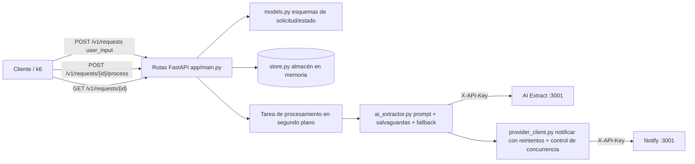

# Arquitectura del Servicio Inteligente de Notificaciones con IA

## Resumen ejecutivo

Esta solución implementa el servicio FastAPI requerido en el puerto 5000 para intenciones de notificación en lenguaje natural. Acepta texto del usuario, consulta al proveedor de IA simulado para extracción estructurada, aplica salvaguardas ante respuestas ruidosas del LLM, recurre a extracción determinista cuando la IA rechaza o devuelve datos inutilizables, y envía notificaciones válidas al proveedor.

## Mapa de componentes



## Flujo de ejecución/datos

1. `POST /v1/requests` valida `{user_input}` y devuelve `201 {id}`.
2. `POST /v1/requests/{id}/process` marca un elemento en cola como `processing` y programa la extracción/entrega en segundo plano. La operación es idempotente: llamadas repetidas mientras ya está en `processing`, `sent` o `failed` devuelven el estado actual sin encolar trabajo duplicado.
3. El worker llama a `/v1/ai/extract` usando un prompt de sistema estricto que solicita JSON compacto con `to`, `message` y `type`.
4. Las salvaguardas analizan variantes comunes de respuesta del LLM:
   - JSON dentro de bloques Markdown con cercas de código.
   - JSON incrustado dentro de prosa.
   - Claves en mayúsculas o con alias (`Recipient/body/channel`, `destination/text/method`).
   - Comillas simples o claves sin comillas.
   - JSON truncado con puntos suspensivos al final, cuando es recuperable.
5. Si la salida de la IA no es utilizable, el servicio recurre a la extracción determinista del prompt original para obtener email/teléfono y texto del mensaje.
6. Las notificaciones válidas se envían a `/v1/notify` con tiempo de espera acotado, límites de concurrencia, id de traza y reintentos ante fallos transitorios.
7. `GET /v1/requests/{id}` devuelve `queued`, `processing`, `sent` o `failed`.

## Notas operativas

- El almacenamiento es en memoria porque el desafío no define ninguna base de datos persistente.
- La URL del proveedor, la clave API, los tiempos de espera y la concurrencia son configurables por entorno.
- El endpoint de estado permanece válido durante la ventana de latencia de la IA; las extracciones prolongadas reportan `processing` en lugar de bloquear las solicitudes del cliente.

## Compromisos para producción

- **Persistencia:** el estado en memoria es adecuado para el evaluador del desafío, pero en producción se debería persistir el estado de las solicitudes y los payloads de notificación extraídos en Postgres/Redis para garantizar seguridad ante reinicios y trazabilidad.
- **Procesamiento duradero:** `BackgroundTasks` de FastAPI mantiene la implementación simple. Un sistema en producción debería usar una cola/worker duradero para sobrevivir a caídas, soportar dead-lettering y aislar las llamadas lentas a la IA/proveedor de los workers de la API.
- **Idempotencia:** `/process` es idempotente a nivel del estado de la aplicación. En producción se debería aplicar la transición de `queued` a `processing` de forma atómica en el almacén de datos y considerar claves de idempotencia para los reintentos del cliente.
- **Extracción por IA:** las salvaguardas manejan el ruido habitual del LLM simulado. En producción se debería preferir salida del modelo restringida por esquema siempre que sea posible, mantener pruebas del parser con ejemplos adversariales y registrar los motivos de fallo de extracción de forma estructurada.
- **Secretos:** la clave API proporcionada en el README se usa como valor por defecto para el desafío. En producción, los secretos deben ser exclusivamente de entorno y estar gestionados por la plataforma de despliegue.
- **Observabilidad:** en producción se deberían añadir logs estructurados, métricas, trazado y dashboards para la latencia de la IA, fallos de extracción, reintentos de notificación y tasas de error del proveedor.

## Verificación

```bash
cd app
python -m venv .venv
. .venv/bin/activate
pip install -r requirements.txt pytest
pytest -q test_main.py
python -m compileall -q main.py test_main.py
```

Se puede realizar una comprobación local de humo iniciando `provider/app.py` en el puerto 3001 y `app/main.py` en el puerto 5000, creando una intención, procesándola y consultando el estado hasta obtener `sent` o `failed`.
